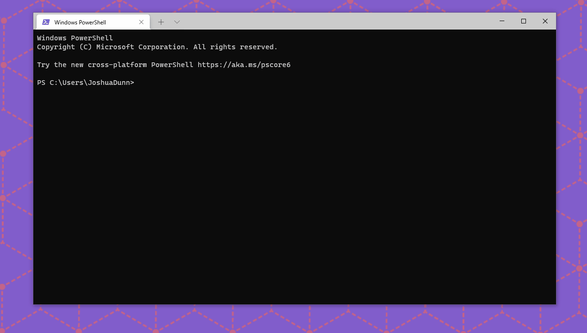

# hw3-red-team-tool
The purpose of this red team tool is to alter user input, and make it impossible for users to type anything productive.
For example if I try to type 'Hello World' while the program is running, the output I will get is 'vHgSQvmjNqg'.
The program runs in the background across all applications.



## Installation
`git clone https://github.com/jtd8414/hw3-red-team-tool.git`

### Required libraries
Use the package manager [pip](https://pip.pypa.io/en/stable/) to install keyboard.
```bash
pip install keyboard
```

### Usage
```bash
python key-distort.py
```
Press `esc` at anytime to close the program. Note, this option should be removed when deployed to a target.

## Deployment
To produce an exe file for installation on target system.
```bash
pip install pyinstaller
pyinstaller -wF key-distort.py --onefile
```

## Author
Joshua Dunn - jtd8414@rit.edu
